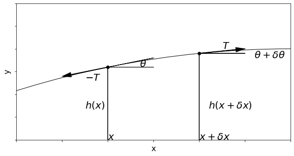
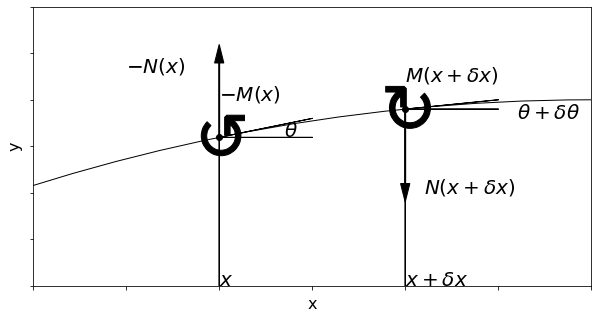

# 弦の波と振動

@tkoyama010

---
## 定義

一定の断面形をもつ柱状の弾性体で

### 棒 

太さがその中を伝わる弾性波の波長に比べ極めて小さいもの

### 糸

棒の中で曲げ剛性率が無視できるほど小さいもの

### 弦 

糸が一定の張力のもとで直線状となったもの

---
## 弦の方程式

`\[
F_{x}\left(x\right) = -T
\]`

`\[
F_{x}\left(x+\delta x\right) = T
\]`

---
## 弦の方程式

$\theta$は微小量であり、$\theta$の2次以上の微小量を無視する

`\[
\sin \theta = \tan \theta = \theta
\]`
`\[
\cos \theta = 0
\]`
`\[
F_{x}\left(x\right) = -T \cos \theta = -T
\]`
`\[
F_{x}\left(x+\delta x\right) = T \cos \left(\theta + \delta \theta\right) = T
\]`
 

---
## 弦の方程式

$\theta$は微小量であり、$\theta$の2次以上の微小量を無視する

`\[
\sin \theta = \tan \theta = \theta
\]`
`\[
\cos \theta = 0
\]`
`\[
F_{y}\left(x\right) = -T \tan \theta = - T h' \left(x\right)
\]`
`\[
F_{y}\left(x+\delta x\right) = T \tan\left(\theta + \delta \theta\right) = T h' \left(x+\delta x\right)
\]`

---
## 弦の方程式

$y$方向の釣り合いについて運動方程式を使用すると

`\[
\rho S \delta x \dfrac{\partial^2 h}{\partial t^2} = F_{y}\left(x\right) + F_{y}\left(x+\delta x\right)
\]`

`\[
\rho S \delta x \dfrac{\partial^2 h}{\partial t^2} = T\left[h'\left(x+\delta x\right) - h'\left(x\right)\right]
\]`

`\[
\dfrac{\partial^2 h}{\partial t^2} = c^2 \dfrac{\partial^2 h}{\partial x^2} \left(c = \sqrt{\dfrac{T}{\rho S}}\right)
\]`

---
## 弦の波

d'Alembertの解

$f$: 正方向の波

$g$: 負方向の波

`\[
h\left(x, t\right) = f\left(x-ct\right) + g\left(x+ct\right)
\]`

正方向の波と、負方向の波は以下のように式変形をすると分かりやすい。

`\[
f\left(x-c\left(t+\Delta t\right)\right) = f\left(\left(x-c\Delta t\right)-ct\right)
\]`

`\[
g\left(x+c\left(t+\Delta t\right)\right) = f\left(\left(x+c\Delta t\right)-ct\right)
\]`

---
## 弦の波 (数学的解釈)

d'Alembertの解(三角関数の複素表示)

`\[
h\left(x, t\right) = A \exp\left[ik\left(x-ct\right)\right] + B \exp\left[ik\left(x+ct\right)\right]
\]`

$A$, $B$: 複素定数

$k$: 実定数

---
## 弦の波 (物理的解釈)

d'Alembertの解(三角関数の複素表示)

`\[
h\left(x, t\right) = A \exp\left[ik\left(x-ct\right)\right] + B \exp\left[ik\left(x+ct\right)\right]
\]`

$A$, $B$: 部分波の複素振幅

$k$: 波数 (0以外の場合、状態量が位置に依存する)

$\lambda\left(=\dfrac{2\pi}{k}\right)$: 波数

$\omega\left(=kc\right)$: 振動数

---
## 弦の正弦振動

単純固定の条件

`\[
h \left(0, t \right) = h \left(L, t \right) = 0
\]`

進行波はこの条件を満たせない。

---
## 弦の正弦振動

空間波形が一定で振幅だけが時間的に変化する**定在波** ($A=B$)で解を探す。

`\[
h = A\exp\left(ikx\right)\left(\exp\left(-ikct\right)+\exp\left(+ikct\right)\right)
\]`

---
## 弦の正弦振動

空間波形が一定で振幅だけが時間的に変化する**定在波** ($A=B$)で解を探す。

`\[
h = 2A\exp\left(ikx\right)\cos\left(kct\right)
\]`

---
## 弦の正弦振動

実在波(実部)のみ条件を満たせば良い。

`\[
A\exp\left(ikx\right) = \left(A_r + iA_i\right)\left(\cos\left(kx\right)+i\sin\left(kx\right)\right)
\]`

---
## 弦の正弦振動

実在波(実部)のみ条件を満たせば良い。

`\[
\Re\left(A\exp\left(ikx\right)\right) = A_r\cos\left(kx\right)-A_i\sin\left(kx\right) = 0
\]`

`\[
\Im \left(A\exp\left(ikx\right)\right) = A_r\sin\left(kx\right)+A_i\cos\left(kx\right)
\]`

---
## 弦の正弦振動

実在波(実部)のみ条件を満たせば良い。

`\[
\Re\left(A\exp\left(ik \cdot 0\right)\right) = A_r\cos\left(k \cdot 0\right)-A_i\sin\left(k \cdot 0\right) = 0
\]`

`\[
\Re\left(A\exp\left(ik \cdot L\right)\right) = A_r\cos\left(k \cdot L\right)-A_i\sin\left(k \cdot L\right) = 0
\]`

---
## 弦の正弦振動

実在波(実部)のみ条件を満たせば良い。

`\[
A_r = 0
\]`

`\[
\sin\left(k \cdot L\right) = 0 \left(k = k_n = \dfrac{n\pi}{L}\right)
\]`

---
## 弦の正弦振動

固有関数
`\[
h = a \sin\left(k_{n} x\right) \cos\left(k_{n} ct\right)
\]`

$a \left(=-2A_i\right)$ : 振幅

$k_n$ : $k$の固有値(固有波数) $\left(n = 0, 1, 2 \cdots \right)$

$k_n c$ : 固有振動数

$k_1$ の正弦解は基本波

$k_2 , k_3 \cdots$ に対応する波は高調波 

---
## 弦の任意波形の振動

`\[
h = \sum^\infty_{n=0}a_n\sin\left(k_nx\right)\cos\left(k_nct\right)
\]`

`\[
a_n = \dfrac{2}{L} \int^L_0 f\left(x\right) \sin\left(k_{n} x\right)dx
\]`

`\[
h = \sum^\infty_{n=0} b_n \sin\left(k_n\right)\sin\left(k_nct\right)
\]`

`\[
b_n = 
\]`

---
# 棒の波と振動

@tkoyama010

棒がいくら細かくても、有限の曲げ剛性がある場合には、弦とは違って、張力を掛けない自然状態のままで弾性波を伝えることができる。

- 棒の伸縮波
- 棒の伸縮運動
- 棒の曲げ変形波
- 棒の曲げ振動

---
## 棒の伸縮波

`\[
P_{11} = YE_{11} = Y\dfrac{\partial \gamma_1}{\partial x_1}
\]`

外力を無視した運動方程式に代入すると。

`\[
\dfrac{\partial u_1}{\partial t} = \dfrac{1}{\rho} = \dfrac{Y}{\rho} \dfrac{\partial^2 r_1}{\partial x_1^2}
\]`

---
## 棒の伸縮波

この式の両辺を時間tで微分して、$\frac{\partial r_1}{\partial t} = u_1$を考慮すれば$u_1$に対する方程式が得られる。

`\[
\dfrac{\partial^2 u_1}{\partial t^2} = \dfrac{Y}{\rho} \dfrac{\partial^2 u_1}{\partial x^2}
\]`

---
## 棒の伸縮波

一般化すると。次の**伸縮波**が得られる。

`\[
\dfrac{\partial^2 u}{\partial t^2} = c_{l\left( rod \right)}^2 \dfrac{\partial u}{\partial x^2}
\]`

`\[
c_{l\left( rod \right)} = \sqrt{\dfrac{Y}{\rho}} = \sqrt{\dfrac{\mu\left(3\lambda+2\mu\right)}{\left(\lambda+\mu\right)\rho}}
\]`

---
## 棒の伸縮波

`\[
c_l^2 - c_{l\left(rod\right)}^2 = \dfrac{\lambda^2}{\left(\lambda+\mu\right)\rho} > 0
\]`

`\[
c_t^2 - c_{l\left(rod\right)}^2 =  -\dfrac{\mu\left(2\lambda+\mu\right)}{\left(\lambda+\mu\right)\rho}< 0
\]`

$c_{l\left(rod\right)$ は $c_l$ と $c_t$ の中間にある。

---
## 棒の伸縮振動

`\[
u\left(0, t\right) = u\left(L, t\right) = 0
\]`

`\[
u = a \sin \left(k_n x\right) \cos \left(k_n c_{l\left(rod\right)} t\right)
\]`

---
## 棒の曲げ変形波

`\[
y = h\left(x, t\right)
\]`

`\[
\rho S \delta x \dfrac{\partial^2 h}{\partial t^2} = N\left(x+\delta x\right) - N\left(x\right)
\]`

---
## 棒の曲げ変形波

`\[
h = \left[A \cos\left(k x\right) + B \sin\left(k x\right) + C \cosh\left(k x\right) + D \sinh\left(k x\right)\right]\cos\left(\omega t\right)
\]`

---
## 棒の曲げ変形波

`\[
-M\left(x\right)+M\left(x+\delta x\right) + N \left(x+\delta x\right) \delta x = O\left(\left(\delta x\right)^3\right)
\]`

`\[
\dfrac{\partial M}{\partial x} + N = 0
\]`

`\[
\dfrac{\partial^3 h}{\partial x^3} + \dfrac{N}{B} = 0
\]`

---
## 棒の曲げ変形波

---
## 棒の曲げ振動

### 一端が固定支持され他端が自由である

$x = 0$ では

`\[
h\left(0\right) = \left[\dfrac{dh}{dx}\right]_{x=0} = 0
\]`

$x = L$ では3階微分も0になることを要求する。

`\[
\left[\dfrac{d^2h}{dx^2}\right]_{x=0} = \left[\dfrac{d^3h}{dx^3}\right]_{x=L} = 0
\]`

---
## 棒の曲げ振動

### 一端が固定支持され他端が自由である

一般解にこれらの要件を要求すると。

`\[
h = \left(A\left(\cos\left(kx\right)-\cosh\left(kx\right)\right)+B\left(\sin\left(kx\right)-\sinh\left(kx\right)\right)\right)\cos\left(\omega t\right)
\]`

---
## 棒の曲げ振動

### 波数と振動数の固有値

以下の式で決定される。

`\[
\cos\left(kL\right)\cosh\left(kL\right)=-1
\]`

---
## 棒の曲げ振動

### 最小固有値

`\[
k_{\min} = k_1 = \dfrac{1.88}{L}
\]`

`\[
\omega_{\min} = bk_{\min}^2 = \dfrac{3.52}{L^2}\sqrt{\dfrac{B}{\rho S}}
\]`

---
## 棒の曲げ振動

`\[
h = A\left(\left[\cos\left(k_nL\right) + \cosh\left(k_nL\right)\right]\left[\cos\left(k_nx\right)-\cosh\left(k_nx\right)\right]+\left[\sin\left(k_nL\right)-\sinh\left(k_nL-\sinh\left(k_nL\right)\right)\right]\left[\sin\left(k_nx\right)-\sinh\left(k_nx\right)\right]\right)\cos\left(
\omega_nt\right)
\]`

---
## 棒の曲げ振動

### 両端が固定されている

`\[
h\left(0\right) = \left[\dfrac{dh}{dx}\right]_{x=0} = 0
\]`

`\[
h\left(L\right) = \left[\dfrac{dh}{dx}\right]_{x=L} = 0
\]`

---
## 棒の曲げ振動

### 波数と振動数の固有値

$k_n$ および $\omega_n$ は以下の式で決定される。

`\[
\cos\left(kL\right)\cosh\left(kL\right) = 1
\]`

---
## 棒の曲げ振動

### 最小固有値

`\[
k_{\min} = k_1 = \dfrac{4.73}{L}
\]`

`\[
\omega_{\min} = bk_{\min}^2 = \dfrac{22.4}{L^2}\sqrt{\dfrac{B}{\rho S}}
\]`

---
## 棒の曲げ振動

### 曲げ振動波形

`\[
h = A\left(\left[\sin\left(k_n L\right)-\sinh\left(k_n L\right)\right]\left[\cos\left(k_n x\right)-\cosh\left(k_n x\right)\right]-\left[\cos\left(k_n L\right)-\cosh\left(k_n L\right)\left(\sin\left(k_n x\right)-\sinh\left(k_n x\right)\right)\right]\right)
\]`

---
## 棒の伸縮振動(例題4-2)

`\[
u = a\sin\left(kx\right)
\]`

一端が固定支持され他端が自由である

`\[
\dfrac{\partial u}{\partial x} = 0
\]`

---
## 棒の伸縮振動(例題4-2)

`\[
k = k_n = \dfrac{\left(2n+1\right)\pi}{L}
\]`

棒の伸縮振動の固有振動数

`\[
\omega = \omega_n = k_n c_{l\left(rod\right)} = \dfrac{\left(2n+1\right)\pi}{2L}\sqrt{\dfrac{Y}{\rho}}
\]`

---
## 棒の曲げ振動(例題4-3)

両端が単純支持

`\[
h\left(0\right) = \left[\dfrac{d^2h}{dx^2}\right]_{x=0} = 0
\]`

`\[
h\left(L\right) = \left[\dfrac{d^2 h}{dx^2}\right]_L = 0
\]`

`\[
\sin\left(kL\right) = 0
\]`

---
## 棒の曲げ振動(例題4-3)

波数と振動数の固有値

`\[
k = k_n = \dfrac{n\pi}{L} \left(n \in \mathbb{N}\right)
\]`

`\[
\omega = \omega_n = bk_{n}^2 = \left(\dfrac{n \pi}{L}\right)^2 \sqrt{\dfrac{B}{\rho S}}
\]`

---
## 棒の曲げ振動(例題4-3)

境界条件

`\[
h\left(0\right) = \left[\dfrac{d^2 h}{dx^2}\right]_{x=0}
\]`

`\[
h\left(L\right) = \left[\dfrac{d^2 h}{dx^2}\right]_{x=L}
\]`

---
## 棒の曲げ振動(例題4-3)

固有値方程式

`\[
\sin\left(kL\right) = 0
\]`

波数と振動数の固有値

`\[
k = k_n = \dfrac{n\pi}{L} \left(n \in \mathbb{N}\right)
\]`
